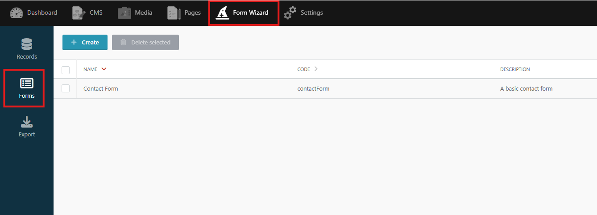
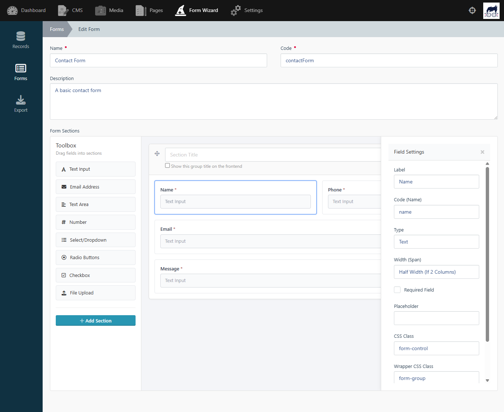

# Form Wizard

This plugin allows you to easily create AJAX forms for Winter CMS.

## Why Form Wizard?
Building forms is a core task in almost every web project. However, manually managing field configurations, validation rules, and data storage can quickly become a repetitive and time-consuming process.

Form Wizard was designed to solve this. It allows you to build powerful forms by simply defining your HTML elements, skipping the boilerplate backend coding. Let the wizardry handle your database storage and email notifications automatically.

### What makes Form Wizard different?
Unlike the original plugin, Form Wizard includes a powerful **Visual Form Builder**. You can now create, manage, and validate forms entirely within the Winter CMS backend, dragging and dropping your way to perfect forms—no HTML required!

## Features
* **Visual Form Builder** (Create forms in the backend)
* Create any type of form: contact, feedback, uploads, etc
* Write only HTML
* Don't code forms logic
* Laravel validation
* Custom validation errors
* Use multiple forms on same page
* Store on database
* Export data in CSV
* Access database records from backend
* Send mail notifications to multiple recipients
* Auto-response email on form submit
* reCAPTCHA validation (v2 and v3)
* Support for Translate plugin
* Inline errors with fields (read documentation for more info)
* File uploads using Filepond

## Quick Start
```bash
composer require thewebsiteguy/wn-formwizard-plugin
php artisan winter:up
```

### Basic Usage
A basic contact is available out of the box. You can find it at:
> /plugins/thewebsiteguy/formwizard/components/contactform

To use it, follow these steps:
1. On your Backend, goto CMS page.
2. Click on the Components button on the left sidebar.
3. Drag selected component to your page.
4. Configure component parameters (like form validation, notification settings, etc)


### Form Builder

You can create and manage forms in the backend, using the Form Builder.



Select a field type to add it to the form. You can drag and drop the fields to reorder them. You can also add sections to the form. Click on the field to edit its properties.


## Documentation
Checkout our docs at:
> https://formwizard.thewebsiteguy.uk

## Credits
This plugin is a substantial rewrite and continuation based on the original work by Martin M. and Joseph Crowell.
